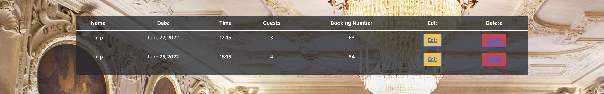

This is a full-stack framework project build using Django, Python, HTML, CSS and JavaScript. The main goal with this project is to create a functioning and responsive full-stack website based around a reservation system. 

A live version can be found [here]()

## **CONTENTS**
- [UX](#ux)
  - [User Stories](#user-stories)
  - [Features](#features) 
- [Database Design](#database-design)
- [Deployment](#deployment)

## **UX**
I started with Strategy, thinking about who was going to use the website and what their goals would be. 

The target audience for this website is:

* All age groups, both men and female.
* People that want to have a table booked so that they dont have to worry about not getting a table.
* People who like swedish food.

The users will be looking for:

* A website that shows information about the restaurant such as, location, contact and menu.
* The ability to book a table for them and their party.
* The ability to manage their booking.

### <ins>USER STORIES</ins>

- As a **site user** i want to be able to view the menu so that i know what food the restaurant serves.
- As a **site user** i can find information about the restaurant so that i can collect information such as contact information and open times.
- As a **site user** i can create an account so that my bookings are saved to my profile.
- As a **site user** i can login so that i can make reservations.
- As a **site user** i can make reservations so that I'm guaranteed a table.
- As a **site user** i can edit and delete my reservations so that the reservation is flexible.
- As a **site owner** i want users not be able to book if all of our tables are full so that i can avoid double bookings.
- As a **site owner** i want to see all of the reservations for the night so that i can greet the customers and show them to their table.

### <ins>WIREFRAMES</ins>
The wire frames for most of the pages showcasing the structure of the site.
Created using 

#### Links to the pages

- [About page](readme/images/about-design.png)
- [Menu page](readme/images/menu-design.png)
- [Register page](readme/images/register-design.png)
- [Login page](readme/images/login-design.png)
- [Book page](readme/images/book-design.png)

### <ins>FEATURES</ins>

#### Home Page

Navigation bar:

* The navigation bar appears on every page witch makes it easy for users to navigate through the website.
* The navigation bar has links for 'Menu', 'About', 'Login', 'Register' and 'Book a table'. Book a table redirects to the login page if the user is not yet logged in.
* If the user is logged in the 'Login' and 'Register' links are replaced by 'Your reservations', 'Logout' and the 'Book a table' link redirects to the reservation page insted of the login page.

* The navigation bar is fully responsive and is collapsing into a hamburger menu for medium and small screen size.

Opening hours:

* The home page welcomes the user and lets them know what the site is for. There is a table that shows the user the restaurants opening hours and contact information.

Food:

* Below the contact information there is an image and a little bit of text that lets the user know what type of food is served.

History:

* Below the food image there is another image and some text that tells the user a little bit of the restaurants history.

Footer:

* Appears on every page.
* Shows copyright text and contact information such as adress, email and phone number.

#### Menu Page

The menu page has three diffrent tabs that shows the menu for starters, mains and desserts. Here the user can find the name of the dish, the price and the ingredients.

#### Register Page

The register page lets the user create an account by entering the following: Username, First name, Last name, email, password and password again for verification

#### Login Page

The login page lets the user login using their username and password

#### Book a Table Page

The book a table page lets the user reserve a table witch is then saved to their account. The user selects a number of guests a date and a time. Once this is done and the user clicks on "Book" a function checks if there are any tables availible and then if there is the user is redirected to a page that shows the reservation details.

#### Reservation details

Shows you that the reservation has been confirmed and shows booking details

#### Your Reservations Page

The reservations page shows the user all of their reservations and lets them edit and delete them.

#### Reservations Page (Admin)

If the site owner is logged in the navigation bar has another link with the text "Reservations". This page shows all of tonights bookings witch makes it easy for the restaurant to greet and show guests to their table.

#### Future Features

* Remove old bookings. 
* Add search bar to the admin reservation page so the restaurant can search for booking numbers or booking names.

## **DATABASE DESIGN**

When creating the project i deployed it to heroku and set up the PostgreSQL database as this is included with heroku.

For creating and storing users i used Django’s built in authentication system django.contrib.auth.models.

#### <ins>Tables</ins>

| Key         | Name        | Type        |
|------------ |------------ |------------ |
| Primary Key | Id          | Int         |
|             | table_size  | Int         |

#### <ins>Reservations</ins>

| Key         | Key          | Type          |
| ----------- | ------------ | ------------- | 
| Primary Key | Id           | Int           | 
| Foreign Key | user         | CharField     | 
|             | party_size   | Int           | 
| Foreign Key | table        | Int           | 
|             | book_date    | DateField     |
|             | book_time    | Choices       |
|             | end_time     | Int           |

For the book_time choices i had the following choices: 

        (1050, '17:30'),
        (1065, '17:45'),
        (1080, '18:00'),
        (1095, '18:15'),
        (1110, '18:30'),
        (1125, '18:45'),
        (1140, '19:00'),
        (1155, '19:15'),
        (1170, '19:30'),
        (1185, '19:45'),
        (1200, '20:00'),
        (1215, '20:15'),
        (1230, '20:30'),
        (1245, '20:45'),
        (1260, '21:00'),
        (1275, '21:15'),
        (1290, '21:30'),
        (1305, '21:45'),
        (1320, '22:00'),

The key is an int witch represents the amount of minutes passed until the time (value). For example, 17:30 in minutes is 17*60 + 30 = 1050.

Insted of having to work with time values i could work with integers witch made things a whole lot easier, each booking is for two hours so all i had to do was set the end_time to the book_time + 120. With this structure it also makes the diffrent choices flexible and i could add any time i wanted without facing any problems with the logic.

## **DEPLOYMENT**

The site is hosted on [Heroku](https://id.heroku.com)

###  <ins>Github and Gitpod</ins>

To create the repository and develop the project i followed the steps below:

1. Create the Github repository and start development:
  * Install the gitpod addon if not already installed. 
  * Go to your github profile and press the green "New" button.
  * Enter a name and for this project i used the Code Institute Full-template provided by them.
  * Once your repository is created in the top right there should be a green button with the text "Gitpod". Press the button and wait for the build to finish.

The code was commited to Git and pushed to Github using the terminal

### <ins>Deploying on Heroku</ins>

To install the Django framework and deploy this project to heroku i followed the Code institutes [Django Blog cheatsheet](https://codeinstitute.s3.amazonaws.com/fst/Django%20Blog%20Cheat%20Sheet%20v1.pdf)

### <ins>Bugs</ins>
Css not working on heroku

assign table to reservation, fix: remove else and return outside of for loop