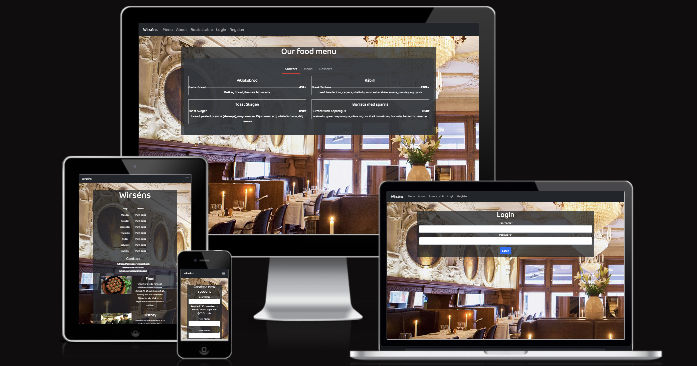
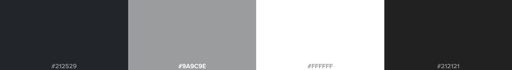
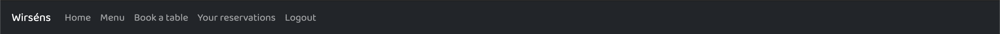
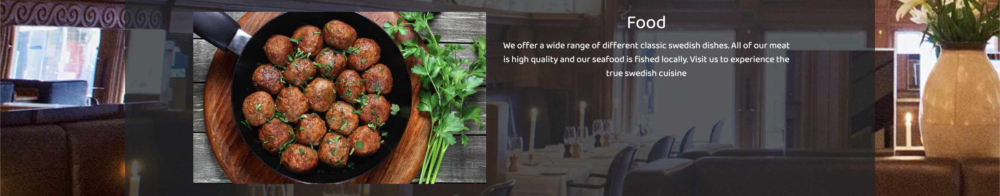
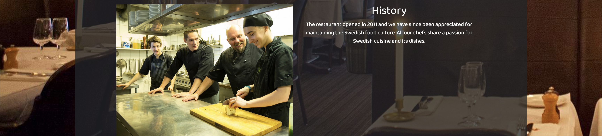
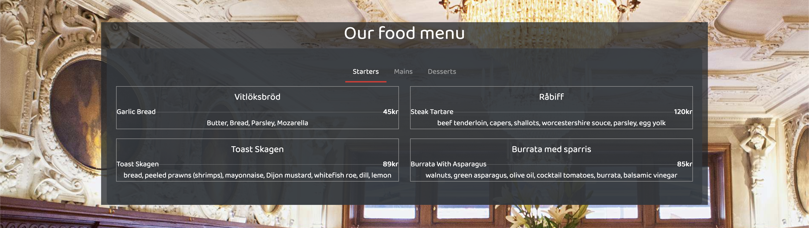
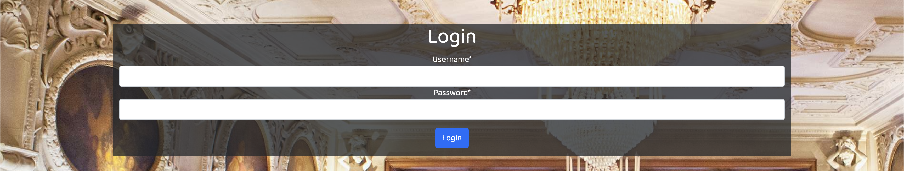
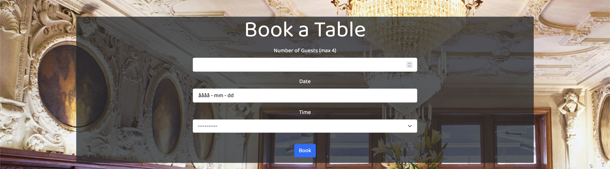
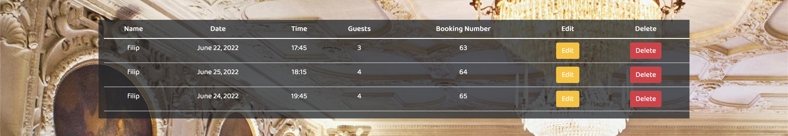

This is a full-stack framework project built using Django, Python, HTML, CSS and JavaScript. The main goal with this project is to create a functioning and responsive full-stack website based around a reservation system for a restaurant. 

A live version can be found [here](https://pp4-restaurant-project.herokuapp.com/)

## **CONTENTS**
- [UX](#ux)
  - [User Stories](#user-stories)
  - [Design](#design)
  - [Features](#features)
- [Technology Used](#technology-used)
- [Database Design](#database-design)
- [Testing](#testing)
- [Deployment](#deployment)
- [Credits](#credits)
- [Acknowledgements](#acknowledgements)

## **UX**

I started with Strategy, thinking about who was going to use the website and what their goals would be. 

The target audience for this website is:

* All age groups, both men and female.
* People that want to have a table booked so that they dont have to worry about not getting a table.
* People who like swedish food.

The users will be looking for:

* A website that shows information about the restaurant such as, location, contact and menu.
* The ability to book a table for them and their party.
* The ability to manage their booking.

### <ins>USER STORIES</ins>

- As a **site user** i want to be able to view the menu so that i know what food the restaurant serves.
- As a **site user** i can find information about the restaurant so that i can collect information such as contact information and open times.
- As a **site user** i can create an account so that my bookings are saved to my profile.
- As a **site user** i can login so that i can make reservations.
- As a **site user** i can make reservations so that I'm guaranteed a table.
- As a **site user** i can edit and delete my reservations so that the reservation is flexible.
- As a **site owner** i want users not be able to book if all of our tables are full so that i can avoid double bookings.
- As a **site owner** i want to see all of the reservations for the night so that i can greet the customers and show them to their table.

### <ins>DESIGN</ins>

#### Wireframe:

The wireframes for most of the pages showcasing the structure of the site. Created using 

* Links to the pages

- [About page](readme/images/about-design.png)
- [Menu page](readme/images/menu-design.png)
- [Register page](readme/images/register-design.png)
- [Login page](readme/images/login-design.png)
- [Book page](readme/images/book-design.png)

#### Color Scheme: 

The main goal for the colors was to create a soothing and relaxing scheme that would make the user feel warm and welcome. The main colors used are the following:

### <ins>Features</ins>

#### Home Page

Navigation bar:

* The navigation bar appears on every page witch makes it easy for users to navigate through the website.
* The navigation bar has links for 'Menu', 'About', 'Login', 'Register' and 'Book a table'. Book a table redirects to the login page if the user is not yet logged in.
* If the user is logged in the 'Login' and 'Register' links are replaced by 'Your reservations', 'Logout' and the 'Book a table' link redirects to the reservation page insted of the login page.

* The navigation bar is fully responsive and is collapsing into a hamburger menu for medium and small screen size.

Opening hours:

* The home page welcomes the user and lets them know what the site is for. There is a table that shows the user the restaurants opening hours and contact information.

Food:

* Below the contact information there is an image and a little bit of text that lets the user know what type of food is served.

History:

* Below the food image there is another image and some text that tells the user a little bit of the restaurants history.

Footer:

* Appears on every page.
* Shows copyright text and contact information such as adress, email and phone number.

#### Menu Page

The menu page has three diffrent tabs that shows the menu for starters, mains and desserts. Here the user can find the name of the dish, the price and the ingredients.

#### Register Page

The register page lets the user create an account by entering the following: Username, First name, Last name, email, password and password again for verification

#### Login Page

The login page lets the user login using their username and password

#### Book a Table Page

The book a table page lets the user reserve a table witch is then saved to their account. The user selects a number of guests a date and a time. Once this is done and the user clicks on "Book" a function checks if there are any tables availible and then if there is the user is redirected to a page that shows the reservation details.

#### Reservation details

Shows you that the reservation has been confirmed and shows booking details

#### Your Reservations Page

The reservations page shows the user all of their reservations and lets them edit and delete them.

#### Future Features

* Add function to delete old reservations from the database so this doesnt have to be done manually.
* Make it easier for the site owner to navigate through all future reservations.
* Now the user gets a message that lets them know if a time can't be booked and they can try again but i would rather have it so that when a user has entered their party size and the date they can press a button "Select time" witch checks all times that can be booked so they dont have to guess for availible times. I tried doing this for hours without sucsess but i would love to add that feature/function in the future.
* Add a function that sends out an email with all booking details to the user.

## **TECHNOLOGY USED**

### <ins>Languages And Frameworks</ins>

* HTML - Used to create the site structure.
* CSS - Used to create styling for the HTML.
*  JavaScript - Used to expand and close the hamburger menu on smaller screen sizes.
* Python - Used to write the logic for the site, models, views, urls, etc.
* Bootstrap - Used to simplify building the structure and styling of responsive elements. Also used to make an mobile-first approach to the site.
* Django - Django was used as the framework within the site was coded.
* Google fonts - Used to add the font Baloo 2.

### <ins>Tools</ins>
* [Balsamiq](https://balsamiq.com/) - Wireframing.
* [Heroku](https://dashboard.heroku.com) - Used for hosting the website.
* [Cloudinary](https://cloudinary.com/) - Used for managing images used in production
* [Crispy Forms](https://django-crispy-forms.readthedocs.io/en/latest/) - was used for styling the register and login form.

## **DATABASE DESIGN**

When creating the project i deployed it to heroku and set up the PostgreSQL database as this is included with heroku.

For creating and storing users i used Django’s built in authentication system django.contrib.auth.models.

#### <ins>Tables</ins>

| Key         | Name        | Type        |
|------------ |------------ |------------ |
| Primary Key | Id          | Int         |
|             | table_size  | Int         |

#### <ins>Reservations</ins>

| Key         | Key          | Type          |
| ----------- | ------------ | ------------- | 
| Primary Key | Id           | Int           | 
| Foreign Key | user         | CharField     | 
|             | party_size   | Int           | 
| Foreign Key | table        | Int           | 
|             | book_date    | DateField     |
|             | book_time    | Choices       |
|             | end_time     | Int           |

For the book_time choices i had the following choices: 

        (1050, '17:30'),
        (1065, '17:45'),
        (1080, '18:00'),
        (1095, '18:15'),
        (1110, '18:30'),
        (1125, '18:45'),
        (1140, '19:00'),
        (1155, '19:15'),
        (1170, '19:30'),
        (1185, '19:45'),
        (1200, '20:00'),
        (1215, '20:15'),
        (1230, '20:30'),
        (1245, '20:45'),
        (1260, '21:00'),
        (1275, '21:15'),
        (1290, '21:30'),
        (1305, '21:45'),
        (1320, '22:00'),

The key is an int witch represents the amount of minutes passed until the time (value). For example, 17:30 in minutes is 17*60 + 30 = 1050.

Insted of having to work with time values i could work with integers witch made things a whole lot easier, each booking is for two hours so all i had to do was set the end_time to the book_time + 120. With this structure it also makes the diffrent choices flexible and i could add any time i wanted without facing any problems with the logic.

## **TESTING**

### <ins>User Story Testing</ins>

- As a **site user** i want to be able to view the menu so that i know what food the restaurant serves.
- As a **site user** i can find information about the restaurant so that i can collect information such as contact information and open times.
- As a **site user** i can create an account so that my bookings are saved to my profile.
- As a **site user** i can login so that i can make reservations.
- As a **site user** i can make reservations so that I'm guaranteed a table.
- As a **site user** i can edit and delete my reservations so that the reservation is flexible.
- As a **site owner** i want users not be able to book if all of our tables are full so that i can avoid double bookings.
- As a **site owner** i want to see all of the reservations for the night so that i can greet the customers and show them to their table.

I asked three of my friends to complete the following tasks and then answer two questions:

* View the menu and write down what you would order for starter, main and dessert.
* Find what kind of food the restaurant serves and how to contact them via email or phone.
* Create an account and make a reservation.
* Find your reservation details.
* Edit your reservation.
* Find your new reservation details.
* Delete your reservation.

1. Whats the purpose of the site?
2. Did you encounter any issues while trying to complete the tasks?

I also asked them to complete theese tasks in the admin panel in the mind of a site owner/restaurant owner:

* Find all bookings for the night.
* Find all bookings for 17:45.
* Find all bookings that are booked for the user "filip"

3. Did you encounter any issues while trying to complete these tasks?

#### Feedback:
Two of them completed the tasks on their computers and the third did it using their mobile device.
All three of them managed to complete the tasks within 10 minutes witch made me sure everything was working fine and that the site was easy to understand and use.

The answers on my questions were the following:

1. As an user i could clearly understand what the goal of the site was and i could complete all tasks without any issues at all.
2. No none at all.
3. When using the admin panel i could filter the dates from today, past 7 days, this month and this year. This was a bit confusing since any bookings earlier than today is irrelevant.

#### Conclusion

The site works fine and from a user perspective it's easy to understand and navigate. In the future i would like to change the admin view so they can see all reservations for ex. tommorow or next week. This would help them know how many guests to expect and would make planing a lot easier.

### <ins>Manual Testing</ins>

I tested the site for errors by using the Mozilla, Microsoft Edge, Safari and Google Chrome Developer Tools console open while performing all user events possible.
To make sure the site contains valid code i validated all code using the following tools:

* HTML - [W3C](https://validator.w3.org/)
* CSS - [W3C](https://jigsaw.w3.org/css-validator/)
* Python - [PEP8](http://pep8online.com)

Only error that returns is that a few lines are a bit too long.

The site was also tested on a few diffrent devices to make sure it works and looks the same on all: macbook, PC, Ipad, Iphone 11 pro and 13 max. 

### <ins>Bugs</ins>
* Css not working on heroku

My CSS file didnt load when viewing the site via heroku. I fixed this by setting debug to False insted of having it on True. When fixing this another thing happend, none of my images were loading. After doing some research I found the reason for this from an answer on Slack from another student. The issue was that I was using relative links. Since relative links only contains the path following my own domain it didnt give the the full information of where im storing the image.

As mentioned earlier i store all of my images on cloudinary so all i had to do was change the relative links to absolute links I did this by changing the following code:

``

To: 
``

* Issue with assigning tables to reservations

 When assigning a table to a reservation it would always try to add table number one to each reservation. Since table one is occupied for two hours after the first reservation you were not able to make any other reservations for two hours earlier or after.

This problem was quite easy to fix, all i had to do was remove an else statement from my for loop that looked for tables that wasnt already booked for that period.

## **DEPLOYMENT**

The site is hosted on [Heroku](https://id.heroku.com)

###  <ins>Github and Gitpod</ins>

To create and develop the project i followed the steps below:

  * Install the gitpod addon if not already installed. 
  * Go to your github profile and press the green "New" button.
  * Enter a name for the project and for this project i used the Code Institute Full-template provided by them.
  * Once your repository is created in the top right there should be a green button with the text "Gitpod". Press the button and wait for the build to finish.
  * Now you can start developing.

The code was commited to Git and pushed to Github using the terminal

### <ins>Deploying on Heroku</ins>

To install the Django framework and deploy this project to heroku i followed the Code institutes [Django Blog cheatsheet](https://codeinstitute.s3.amazonaws.com/fst/Django%20Blog%20Cheat%20Sheet%20v1.pdf)

## **CREDITS** 

* [Djecrety](https://djecrety.ir/) was used to generate my secret key
* For my menu page i used i copied a template that i found on [Bootdey](https://www.bootdey.com/snippets/view/bs4-Food-Menu) and modified the code to fit my project.
* All images are taken from google and they all have the creative commons license.
* [Stack Overflow](https://stackoverflow.com/) was used for research and inspiration.
* [Django Documentaion](https://docs.djangoproject.com/en/4.0/)

## **ACKNOWLEDGEMENTS**

* I would like to thank all of my friends that helped me test the site and make sure it was working correctly
* Without my awsome mentor Akshat i would propably still be smashing my head against my keyboard haha. Jokes aside he really helped me to get another perspective on things and made thinking about the logic a whole lot
