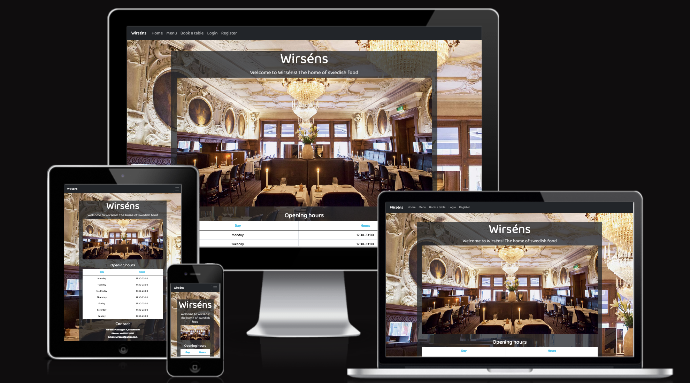

This is a full-stack framework project build using Django, Python, HTML, CSS and JavaScript. The main goal with this project is to create a functioning and responsive full-stack website based around a reservation system. 

A live version can be found [here]()

## **CONTENTS**
- [UX](#ux)
  - [User Stories](#user-stories)
- [Features](#features) 
  - [Home Page](#home-page)
  - [Menu Page](#menu-page)
  - [Register Page](#register-page)
  - [Login Page](#login-page)

## **UX**
I started with Strategy, thinking about who was going to use the website and what their goals would be. 

The target audience for this website is:

* All age groups, both men and female.
* People that want to have a table booked so that they dont have to worry about not getting a table.
* People who like swedish food.

The users will be looking for:

* A website that shows information about the restaurant such as, location, contact and menu.
* The ability to book a table for them and their party.
* The ability to manage their booking.

### <ins>USER STORIES</ins>

- As a **site user** i want to be able to view the menu so that i know what food the restaurant serves.
- As a **site user** i can find information about the restaurant so that i can collect information such as contact information and open times.
- As a **site user** i can create an account so that my bookings are saved to my profile.
- As a **site user** i can login so that i can make reservations.
- As a **site user** i can make reservations so that I'm guaranteed a table.
- As a **site user** i can edit and delete my reservations so that the reservation is flexible.
- As a **site owner** i want users not be able to book if all of our tables are full so that i can avoid double bookings.
- As a **site owner** i want to see all of the reservations for the night so that i can greet the customers and show them to their table.

### <ins>FEATURES</ins>

#### Home Page

Navigation bar:

* The navigation bar appears on every page witch makes it easy for users to navigate through the website.
* The navigation bar has links for 'Menu', 'About', 'Login', 'Register' and 'Book a table'. Book a table redirects to the login page if the user is not yet logged in.
* If the user is logged in the 'Login' and 'Register' links are replaced by 'Your reservations', 'Logout' and the 'Book a table' link redirects to the reservation page insted of the login page.

* The navigation bar is fully responsive and is collapsing into a hamburger menu for medium and small screen size.

Opening hours:

* The home page welcomes the user and lets them know what the site is for. There is a table that shows the user the restaurants opening hours and contact information.

Food:

* Below the contact information there is an image and a little bit of text that lets the user know what type of food is served.

History:

* Below the food image there is another image and some text that tells the user a little bit of the restaurants history.

Footer:

* Appears on every page.
* Shows copyright text and contact information such as adress, email and phone number.

#### Menu Page

The menu page has three diffrent tabs that shows the menu for starters, mains and desserts. Here the user can find the name of the dish, the price and the ingredients.

#### Register Page

The register page lets the user create an account by entering the following: Username, First name, Last name, email, password and password again for verification

#### Login Page

The login page lets the user login using their username and password

#### Book a Table Page

The book a table page lets user reserve a table witch is then saved to their account. The user selects a number of guests a date and a time. Once this is done and the user clicks on "Book" a function checks if there are any tables availible and then reserves the table.

### <ins>Bugs</ins>
Css not working on heroku

assign table to reservation, fix: remove else and return outside of for loop